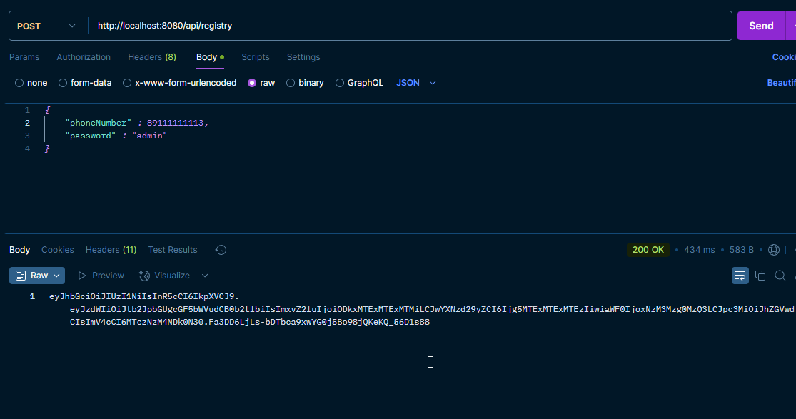
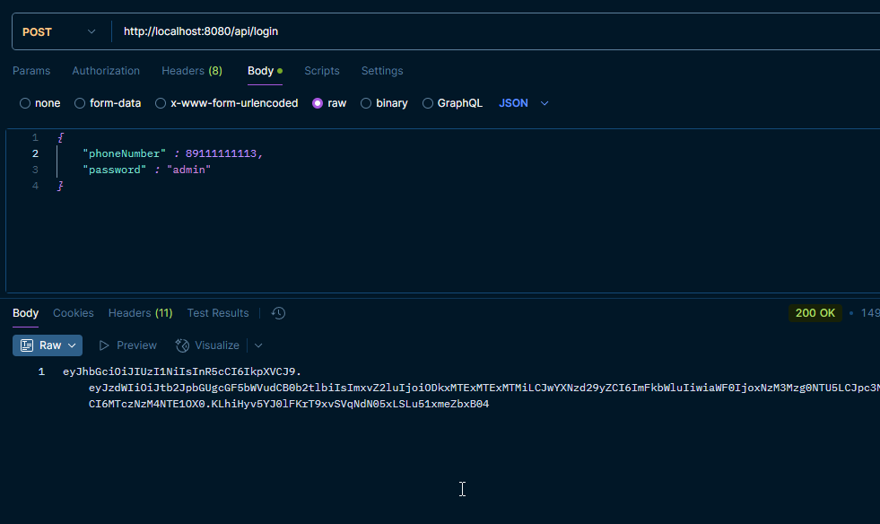

Напишите простое spring boot приложение, позволяющее имитировать оплату услуг мобильной связи. Предполагается, что в нем будет набор http-методов, принимающих запросы из стороннего клиента (Postman, wget, curl и т.д.), какого либо пользовательского web-интерфейса (UI на html и js) в приложении не требуется.

Вся необходимая информация о пользователе хранится в БД. Для основной части это - id, логин, хэш пароля, баланс, произведенные оплаты (id, дата, номер телефона, сумма). Для дополнительной части еще понадобятся ФИО, email, пол и дата рождения.

Основная часть:
1) Регистрация пользователя. Это единственный метод в приложении доступный без авторизации. Все остальные http-методы используют базовую авторизацию. В качестве логина лучше взять номер телефона. После регистрации на баланс пользователя зачислять 1000 рублей, другие способы пополнения не предусмотрены.
2) Получение баланса денежных средств. На основе авторизационных данных возвращать текущее значение баланса счета и логин пользователя.
3) Оплата. Метод API должен принимать номер телефона на который совершается оплата и  сумму (с копейками). Если денег на счете пользователя достаточно - списываем их и возвращаем ответ, что оплата прошла успешно. Сохраняем информацию о произведенной оплате в базу данных.

Дополнительная часть:
1) Редактирование пользовательских данных. Пользователь должен иметь возможность создать/исправить свои ФИО, email, пол и дату рождения.
2) История операций. Возвращать список оплат, выполненных пользователем (он - плательщик). Id операции, телефон, сумма, число. Добавить пагинацию в этот метод. Условно, из имеющихся 35 записей отдельно получать постранично 10 записей.
3) Юнит-тесты по реализованному функционалу.

При выполнении задания рекомендуется использовать:
1) Java 21
2) Spring boot 3.2.x
3) Postgresql 16 (возможно использование MySQL/MariaDB)

Документация доступна по URL: http://localhost:8080/swagger-ui/index.html

Как делать запросы:
1) 
2) 
3) 

